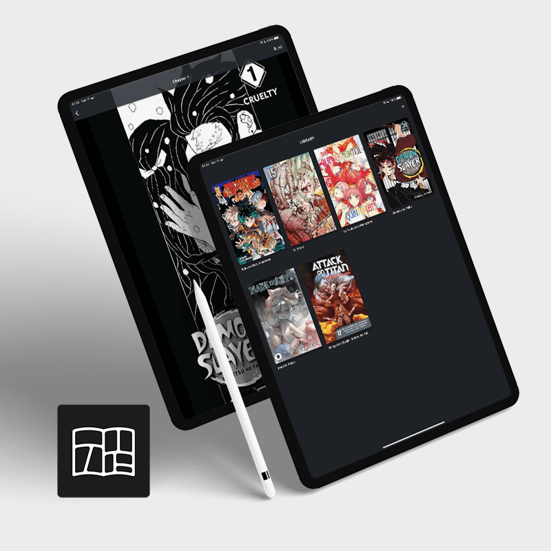

# MAPI
Simple manga reader app for MangaSee.\
Mind that this is my very first attempt on using Flutter.

### Why
I wanted to try out Flutter, and i needed an app to read mangas on iPad.\
So i've put those 2 things together and here we are.

### The app
This app uses an integrated web scraper that will provide data found on [MangaSee](https://mangasee123.com/).

At the moment the app works without major issues, but has just these basic features:
- **Search page**: here you can search for a specific manga, but it will only work with titles used on MangaSee,
so for example you won't find "Demon Slayer" but you will have to search for "Kimetsu no Yaiba".\
Pressing the search button without any keyword will show all mangas found on MangaSee in alphabetical order.
- **Manga page**: once you tap on a manga you will see some basic info (cover, title, status, genre) aswell as
it's chapters list. On the top right corner the star icon will allow you to save it to your Library (it's a favourite button basically).\
Saving a manga to your library will allow you to keep track of read/not read chapters.
- **Library page**: This is the very first page you will see, here you will see all your saved mangas.

Since MangaSee is already having issues (sometimes) with server load, I coded this app so that when you hit the "Search" button, it will
store the complete JSON of mangas available its local Database, and concurrent request will read from it instead of requiring a new "Scraping".
The cached results will expire in 24 hours.
I made it this way because MangaSee's `/search` page it's pretty heavy, and requesting it for each search would mean a pretty huge load on their side.

### How to build

#### Android
```sh
flutter pub get
flutter build apk --release --obfuscate --split-debug-info=build/app/outputs/symbols --split-per-abi
```
Then you should find `app.apk` under `build/app/outputs/flutter-apk/`.

#### iOS
Since I don't have a paid Apple Developer account, to put the app in my iPad i usually run it in release mode with my iPad connected over USB and selected as Destination Device.
```sh
flutter pub get
flutter run --release
```
I'm still investigating a better way to do this.

### TODO
- Image load time is slow sometimes, i need to check if it's code related or it's just my WiFi that's shit